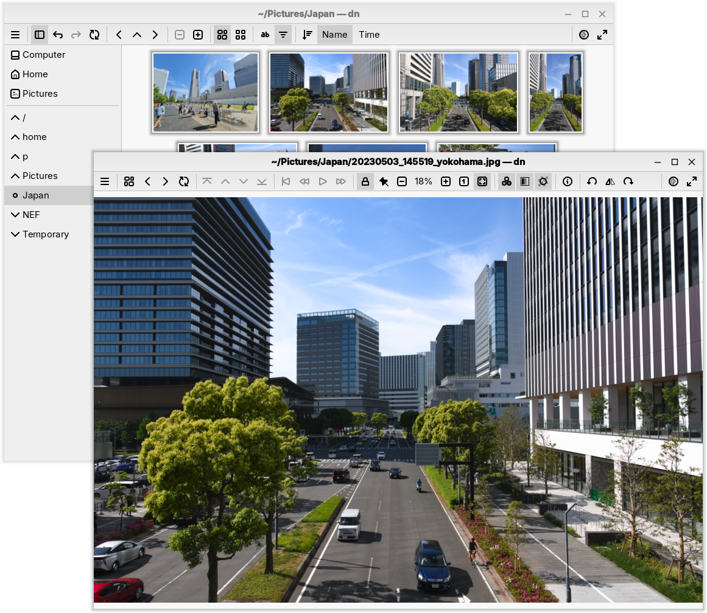
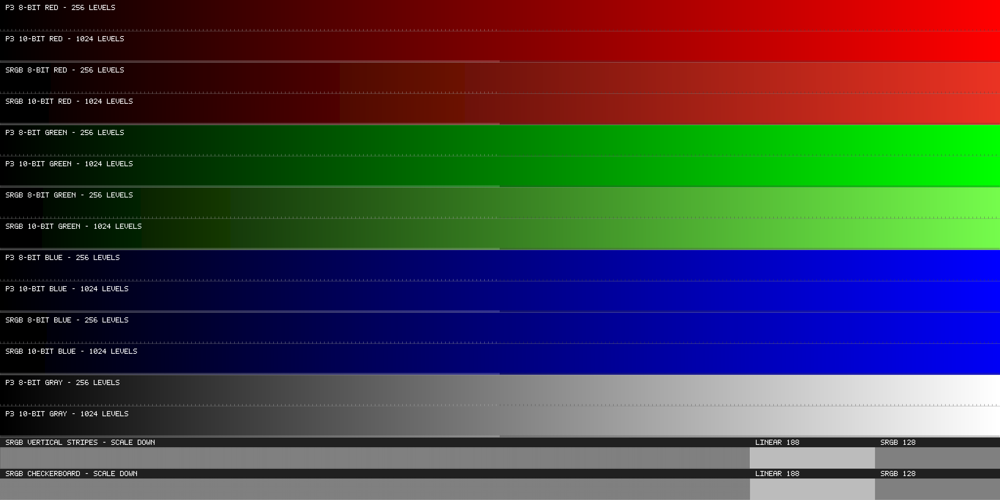

Dawn
====
:compact-option:

'Dawn' is a multiplatform colour-managed image browser, with very high standards
for fidelity and responsivity.



Design-wise, the project is an amalgamation of
https://git.janouch.name/p/fiv[older efforts] and
https://git.janouch.name/p/gallery[desires].
Right now, we've mostly reached our first milestone, and we're cleaning up
AI-accelerated mess before we can afford to continue making large steps.

The project comes with a promise of basic maintenance.
Also see link:docs/plan.adoc[Plan],
and a detailed link:docs/rationale.adoc[Rationale].

Features
--------
We care about
~~~~~~~~~~~~~
 - *Wide-gamut*, high bit depth SDR: 10-bit displays in Adobe RGB or Display P3.
 - *16-bit* internal precision in order to minimise quantisation errors.
 - *Gamma-correct* scaling: see below for a test that your iPhone fails.
 - *Good scaling*: GIMP's NoHalo is an awesome compromise for upscaling
   of both photos and man-made images.
 - *Loading as much as we can* from any file format at the best possible
   quality: multi-page TIFF, 16-bit PNG, 12-bit JPEG, etc.;
   resolutions up to 65535 at least on one side.
 - *Making good use of computing resources*: exercise the GPU and all CPU cores.
 - *Superb keyboard accessibility*: we recognise
   https://p.janouch.name/text/human-interface-guidelines.html[HIGs]
   and also have Vimium-style link hints.
 - *We never silently move or modify image files.*

Do it yourself
~~~~~~~~~~~~~~
 - HDR: the project scope is huge as it is, but you're welcome to lend a hand.

Rejected
~~~~~~~~
 - Image editing: GIMP works well enough already.
 - UI animations are found to be distracting, frustrating, and even despised.

Packages
--------
Things are in flux.  Linux and macOS are currently too painful to provide
portable packages for: the former needs labour, the latter money.

https://janouch.name/cd[Windows packages can be found here],
and they work in Wine.

On Windows, if your account is '`high integrity`' and you have no true Vulkan
backend installed, manually rename 'vk_swiftshader.dll' to 'vulkan-1.dll'.
You will obtain software rendering.

Building
--------
Instructions for Debian 13 Trixie, which should generally apply to other systems
as well:

```sh
# Required dependencies
apt install build-essential cmake qt6-base-dev glslang-tools librsvg2-bin \
  libwebp-dev libjpeg-dev libcolord-dev shared-mime-info

# Optional dependencies
apt install librsvg2-dev libxcursor-dev libheif-dev libtiff-dev libraw-dev \
  libgdk-pixbuf-2.0-dev qt6-wayland-dev wayland-protocols

# libresvg-dev is required but not often packaged, thus you may need to build it
apt install cargo cargo-c
ver=$(sed -n 's/.*resvg-\([0-9.]*\)\.tar.*/\1/p' msys2-configure.sh)
archive=resvg-$ver.tar.xz
curl -#LO https://github.com/linebender/resvg/releases/download/v$ver/$archive
tar xJf $archive
cargo cinstall --release --prefix $PWD/resvg-prefix \
  --manifest-path resvg-$ver/crates/c-api/Cargo.toml

# The application will run much faster if you allow bundling Little CMS
cmake -S . -B build -DCMAKE_BUILD_TYPE=Release -DDAWN_BUNDLED_LCMS2=ON \
  -DCMAKE_PREFIX_PATH=$PWD/resvg-prefix -DCMAKE_INSTALL_PREFIX=/usr
(cd build && cpack -G DEB)
```

macOS successfully produces a portable application bundle with Homebrew,
however there is currently no one to sign these packages.

Windows is cross-compiled in CI:

```sh
sh -e msys2-configure.sh build-msys2 -DCMAKE_BUILD_TYPE=Release
cmake --build build-msys2 -- package
```

Configuration
-------------
See link:docs/configuring-your-system.adoc[Configuring your system].
If everything goes beautifully, the following test image will exercise your
display's true gamut, and you'll be able to see the finer steps.
The bottom row should look more like '`linear 188`' (a popular bug).



Note that 'Dawn' currently implements Bayer dithering, so you might not
be able to distinguish an 8-bit swapchain.

Competition
-----------
The macOS 'Preview.app' is excellent at what it does, if limited in scope:
it effortlessly handles wide gamuts, high bit depth, and gamma-correct scaling.

Electron-based viewers like
_https://github.com/Auxx/light-matter['Light Matter']_
are promising in that browser engines typically handle things well,
at the cost of being rather heavy-weight.

'digiKam' must be mentioned, as it covers a lot of the advanced features
of this project.  Sadly, it's obviously been designed by programmers,
and the programmer behind 'Dawn' can't make heads or tails of the UI.

Resources
---------
 - https://wolf.nereid.pl/posts/image-viewer/

Contributing and Support
------------------------
Use https://git.janouch.name/p/dawn to report any bugs, request features,
or submit pull requests.  `git send-email` is tolerated.  If you want to discuss
the project, feel free to join at ircs://irc.janouch.name, channel #dev.

Bitcoin donations are accepted at: 12r5uEWEgcHC46xd64tt3hHt9EUvYYDHe9

License
-------
This software is released under the terms of the MPL 2.0 license, the text of
which is included within the package along with the list of authors.
