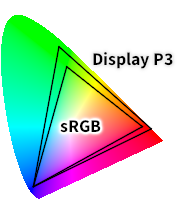
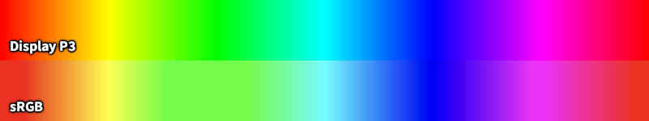
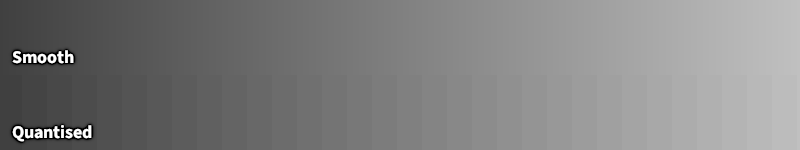
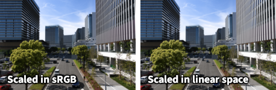
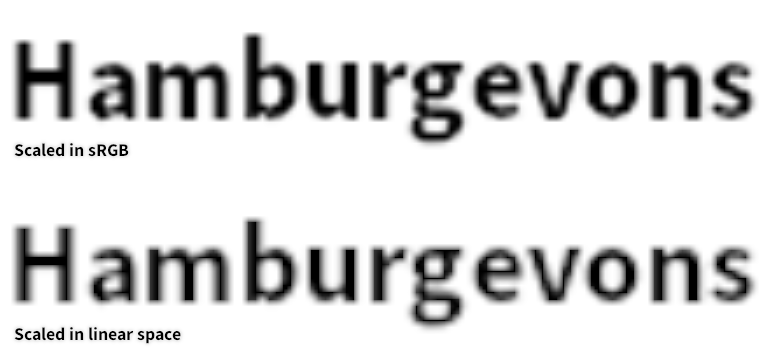
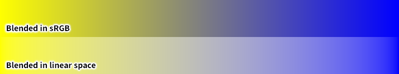
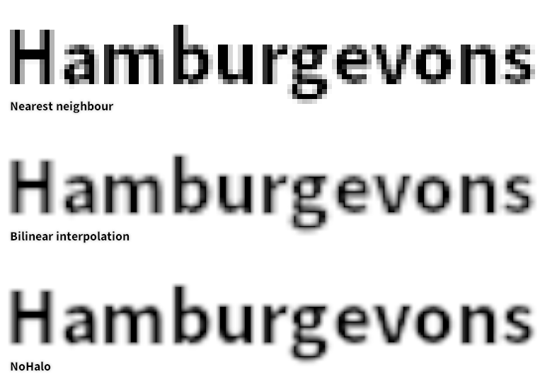

Why you need a better image viewer
==================================

...or a better operating system, computer, monitor.  This could be a whole
booklet, so forgive the brevity.

Wide gamuts
-----------
Today's displays commonly have colour gamuts going beyond sRGB.
The difference between the old standard and Apple's Display P3
(which is slowly displacing the former) may not look significant on paper,
but you will certainly notice it in photos:

[.text-center]

Allow me to use a dishonest image to illustrate the magnitude of the difference
on the hue spectrum:

[.text-center]

A good image viewer takes care to neither undersaturate nor oversaturate
images (which can be in any colour space they want, as can your display).
And most actually do, these days, at least to a basic extent.
So let's move on to...

Bit depth
---------
Today's displays can often display more than 16.7 million colours.  At 1.07
billion colours of 10-bit panels, banding can finally become almost invisible
to the human eye.  To illustrate the issue:

[.text-center]

If you see no difference, I'm very sorry, because your panel is exactly
6-bit, which was rather common in cheap laptops--I happen to own one.

Hardware and operating system support are actually just two pieces of
the puzzle, and they happen to be ones you can circumvent with
https://en.wikipedia.org/wiki/Dither[dithering].
Most content today is simply 8-bit.  But even there, the transformation that may
be necessary to deal with gamut mismatches leads to quantisation errors.

Dawn will help you see things smoothly in all cases.

Gamma correctness
-----------------
Colour blending must be done in linear space.  Doing it wrong is easier,
thus _most software fails at this_ in one way or another.
The manifestations are as subtle as they are pervasive.

When zooming out, high-frequency details look wrong, such as the building on
the right side:

[.text-center]

When zooming in, things may end up too thick or thin:

[.text-center]

And transitions between pure hues go through darkness:

[.text-center]

That said, compositing physically correctly creates issues as well, notably
around https://docs.skia.org/docs/dev/design/raster_tragedy/[text rendering].
Some content is also designed to be rendered wrong, such as macOS icons.
Dawn tries to use a sane defaults, and lets you switch.

Scaling
-------
There is one more improvement to make about scaling, and that is
the filtering algorithm.

[.text-center]

The blocky method of not even trying is only here for reference, although its
rough precision is what makes it indispensable.  For general imagery, you want
to smooth it out.

The simple and fast method is bilinear interpolation.  If you look at it
closely, it retains pixel edges, in a pretty noticeable way.  Luckily, modern
hardware allows Dawn to throw a better alternative at the problem in real time:
the NoHalo algorithm, originally coming from GIMP.  The edges are almost gone,
and it doesn't add the ringing artifacts which bicubic or other filtering would.

And more
--------
This is just the tip of the iceberg.  Dawn is the image viewer that cares about
doing things better.
